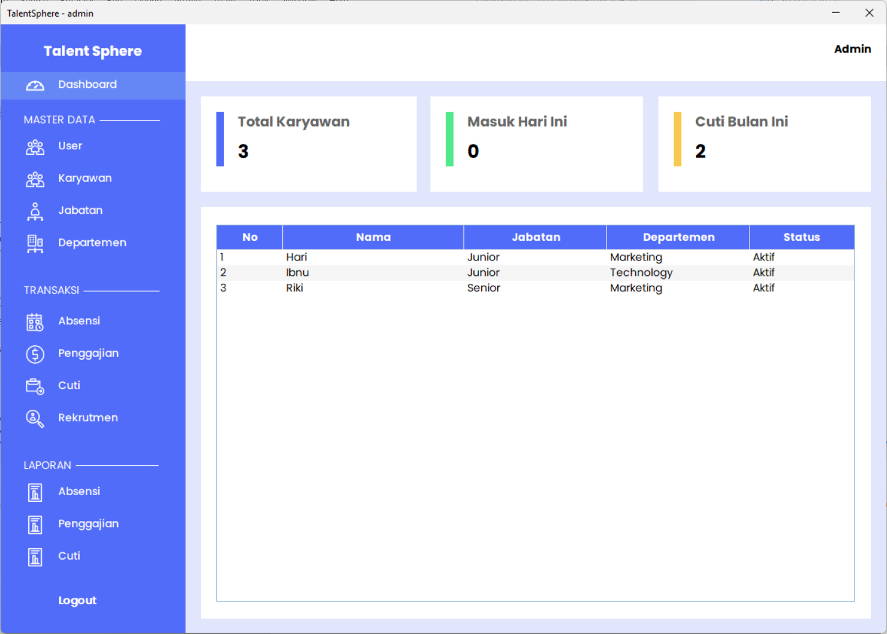
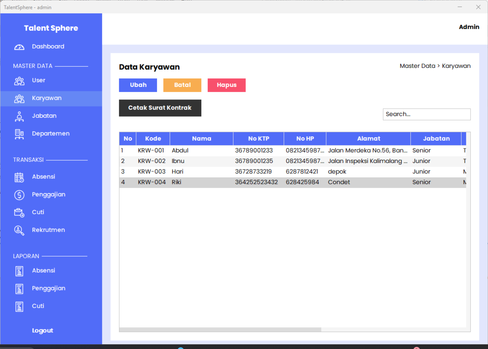

# TalentSphere - Human Resources Management System


TalentSphere is a desktop-based Human Resources Management System (HRMS) developed with Java Swing for the UI and MySQL for database storage.

## Features

- **Employee Management**
  - Add/edit/delete employee records
  - Track employee details and contracts
  - Generate employment documents

- **Attendance Tracking**
  - Daily attendance recording
  - Attendance reports by date range
  - Export attendance data

- **Leave Management**
  - Leave request submission
  - Leave approval workflow
  
- **Payroll System**
  - Salary calculation
  - Pay slip generation
  

## Prerequisites

- Java JDK 17 or higher
- MySQL Server 8.0
- Maven 3.8.6 or higher
- JasperReports Library 6.19.0


## Configuration
  Edit the database connection settings in:
   ```java
   src/main/java/config/DatabaseConnection.java
   ```
  Set your MySQL credentials:
  ```java
  private static final String URL = "jdbc:mysql://localhost:3306/talent_sphere2";
  private static final String USER = "your_username";
  private static final String PASSWORD = "your_password";
  ```

## Step-by-Step Installation

1. **Clone the repository**:
   ```bash
   git clone https://github.com/darwisyalfarizi/TalentSphere.git
   cd TalentSphere
   ```
2. **Set up the database:**:
   ```bash
   mysql -u root -p < database/talent_sphere2.sql
   ```
3. **Build the application:**:
   ```bash
   mvn clean install
   ```
2. **Run Application:**:
   ```bash
   java -jar target/TalentSphere.jar
   ```

## Screenshots

| Description | Preview |
|-------------|---------|
| **Login Application** |  |
| **Main Application Dashboard** |  |
| **Employee Management Screen** |  |

## License

This project is licensed under the MIT License - see the [LICENSE](LICENSE) file for details.

## Contact

For support or contributions:

- **Name:** Darwisy Alfarizi  
- **GitHub:** [@darwisyalfarizi](https://github.com/darwisyalfarizi)  

---

**TalentSphere** © 2025 - Human Resources Management System
